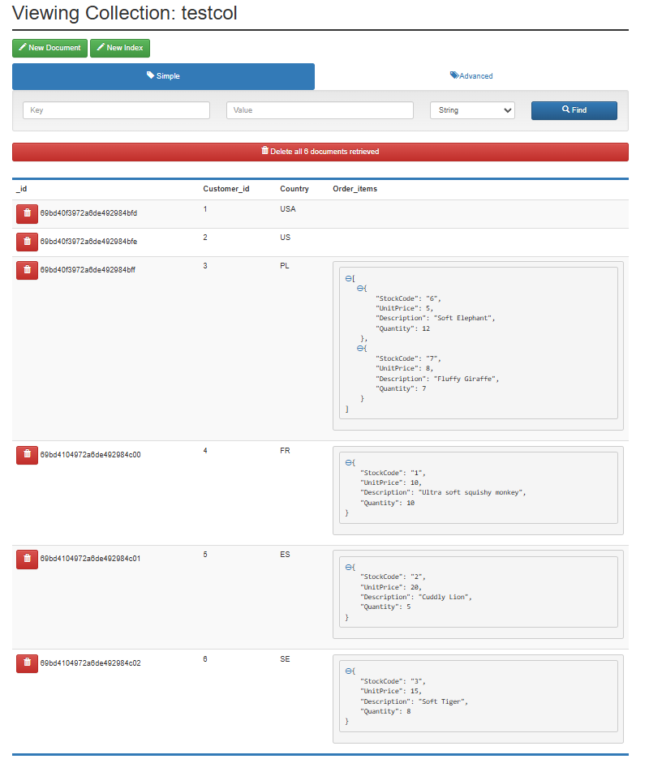
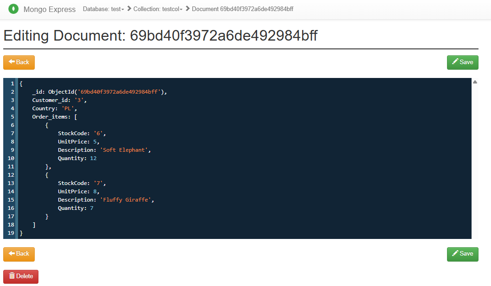

# 📦 MongoDB Minimal Demo

This repository demonstrates **basic MongoDB operations** using:

* 🐳 Docker (MongoDB + mongo-express)
* 🐍 Python (`pymongo`)
* 📓 Jupyter Notebook (CRUD + document model)

---

## 🚀 Quick Start

### 1. Clone repository

```bash
git clone <your-repo-url>
cd <repo-name>
```

---

### 2. Configure environment

Copy the example file and update credentials:

```bash
cp .env.example .env
```

Edit `.env` and set your own values:

```bash
MONGO_USER=your_user
MONGO_PASSWORD=your_password
ME_USER=your_user
ME_PASSWORD=your_pswd
```

---

### 3. Start MongoDB

```bash
docker compose up -d
```

* MongoDB → `localhost:27017`
* Mongo Express UI → http://localhost:8081

---

### 4. Setup Python environment

```bash
python -m venv venv
source venv/bin/activate      # Linux / Mac
venv\Scripts\activate         # Windows

pip install -r requirements.txt
```

---

### 5. Run notebook

Open the notebook in `/code` and execute cells.
Review results in notebook cells or mongo express.

## Mongo Express UI


## Document example


---

## 🧠 About MongoDB

MongoDB is an open-source **NoSQL document database** designed for:

* ⚡ High performance
* 📈 Horizontal scalability
* 🔄 Flexible schema

Instead of tables and rows, it stores data as:

> **JSON-like documents (BSON)**

### 🏗️ Data Model

```
Database → Collections → Documents → Fields
```

This makes MongoDB suitable for:

* Rapidly evolving applications
* Large datasets
* Real-time processing

---

## 💼 Use Cases

* 🛒 **E-commerce** → product catalogs, inventory, customer analytics
* 🎮 **Gaming** → real-time multiplayer state and session data
* 📰 **Content platforms** → CMS and dynamic content
* 🤖 **AI systems** → embeddings, user interactions, RAG pipelines

---

## 📚 Key Terminology

| Term           | Description                      |
| -------------- | -------------------------------- |
| **Database**   | Container for collections        |
| **Collection** | Group of related documents       |
| **Document**   | Single record (JSON-like object) |
| **Field**      | Key-value pair in a document     |

---

## ⚖️ Trade-offs

### ✅ Advantages

* Flexible schema
* Handles nested / hierarchical data well
* Easy horizontal scaling (sharding)

### ⚠️ Limitations

* No enforced schema → risk of inconsistency
* Limited JOIN capabilities vs relational databases
* Requires careful data modeling for analytics

---

## 🧩 Project Structure

```
.
├── docker-compose.yml
├── .env.example
├── requirements.txt
└── code/
    └── MongoDB demo.ipynb
```

---

## 🐳 Notes

* Uses Docker for reproducible local setup
* Configuration via `.env` (not committed)
* Works on Windows (WSL), Linux, and Mac

---

## 📌 Purpose

This project is a **minimal, practical introduction** to MongoDB for developers:

* understand document model
* perform CRUD operations
* work with nested and array data

---

  **Dominik Mikulski**  
  Expanding hands-on data engineering capabilities alongside 12 years of analytics leadership
  [LinkedIn](https://www.linkedin.com/in/dominikmikulski/) | [dominik.mikulski@gmail.com](mailto:dominik.mikulski@gmail.com)
